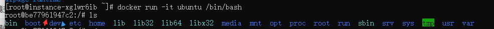

## 1. 命令总览

| 命令                 | 含义                                                         | 案例                                                         |                                                     |
| :------------------- | :----------------------------------------------------------- | :----------------------------------------------------------- | --------------------------------------------------- |
| run                  | 从镜像运行一个容器                                           | docker run ubuntu /bin/echo 'hello-world'                    |                                                     |
| ls                   | 列出容器                                                     | docker container ls                                          |                                                     |
| inspect              | 显示一个或多个容器详细信息                                   | docker inspect                                               |                                                     |
| attach               | 要attach上去的容器必须正在运行，可以同时连接上同一个container来共享屏幕 | docker attach [OPTIONS] CONTAINER                            | docker attach 6d1a25f95132                          |
| stats                | 显示容器资源使用统计                                         | docker container stats                                       |                                                     |
| top                  | 显示一个容器运行的进程                                       | docker container top                                         |                                                     |
| update               | 更新一个或多个容器配置                                       |                                                              | docker update -m 500m --memory-swap -1 6d1a25f95132 |
| port                 | 列出指定的容器的端口映射                                     | docker run -d -p 8080:80 nginx docker container port containerID |                                                     |
| ps                   | 查看当前运行的容器                                           | docker ps -a -l                                              |                                                     |
| kill [containerId]   | 终止容器(发送SIGKILL )                                       | docker kill [containerId]                                    |                                                     |
| rm [containerId]     | 删除容器                                                     | docker rm [containerId]                                      |                                                     |
| start [containerId]  | 启动已经生成、已经停止运行的容器文件                         | docker start [containerId]                                   |                                                     |
| stop [containerId]   | 终止容器运行 (发送 SIGTERM )                                 | docker stop [containerId] docker container stop $(docker container ps -aq) |                                                     |
| logs [containerId]   | 查看 docker 容器的输出                                       | docker logs [containerId]                                    |                                                     |
| exec [containerId]   | 进入一个正在运行的 docker 容器执行命令                       | docker container exec -it f6a53629488b /bin/bash             |                                                     |
| cp [containerId]     | 从正在运行的 Docker 容器里面，将文件拷贝到本机               | docker container cp f6a53629488b:/root/root.txt .            |                                                     |
| commit [containerId] | 根据一个现有容器创建一个新的镜像                             | docker commit -a "zhufeng" -m "mynginx" a404c6c174a2 mynginx:v1 |                                                     |

docker容器的主线程（dockfile中CMD执行的命令）结束，容器会退出

- 以使用交互式启动 `docker run -i [CONTAINER_NAME or CONTAINER_ID]`
- tty选项 `docker run -dit [CONTAINER_NAME or CONTAINER_ID]`
- 守护态（Daemonized）形式运行 `docker run -d ubuntu /bin/sh -c "while true; do echo hello world; sleep 1; done"`

## 2. 启动容器

```js
docker run ubuntu /bin/echo "Hello world"
```

- docker: Docker 的二进制执行文件。
- run:与前面的 docker 组合来运行一个容器。
- ubuntu指定要运行的镜像，Docker首先从本地主机上查找镜像是否存在，如果不存在，Docker 就会从镜像仓库 Docker Hub 下载公共镜像。
- /bin/echo "Hello world": 在启动的容器里执行的命令

> Docker以ubuntu镜像创建一个新容器，然后在容器里执行 bin/echo "Hello world"，然后输出结果
>
> - Docker attach必须是登陆到一个已经运行的容器里。需要注意的是如果从这个容器中exit退出的话，就会导致容器停止

| 参数              | 含义               |                                                              |
| :---------------- | :----------------- | ------------------------------------------------------------ |
| -i --interactive  | 交互式             |                                                              |
| -t --tty          | 分配一个伪终端     |                                                              |
| -d --detach       | 运行容器到后台     |                                                              |
| -a --attach list  | 附加到运行的容器   |                                                              |
| -e --env list     | 设置环境变量       | docker run -d -p 1010:80 -e username="zhufeng" nginx \ docker container exec -it 3695dc5b9c2d /bin/bash |
| -p --publish list | 发布容器端口到主机 |                                                              |
| -P                | --publish-all      |                                                              |

```shell
docker run ubuntu -it /bin/bash
# 交互式
# 分配一个伪终端
# 进入到容器里
# 可以通过运行exit命令或者使用CTRL+D来退出容器
```



通过以上图片可以看出

### 2.1 进入到容器里

```shell
docker ps  # 查看up(启动) 状态的容器
docker exec -it be77961947c2 /bin/bash # 进入到容器里面
docker attach be77961947c2  # 进入到容器里面
```

## 2. 查看容器

```shell
docker ps # 查看启动状态的容器
docker ps -a
docker -a
docker -l
```

- -a 显示所有的容器，包括已停止的
- -l 显示最新的那个容器

| 字段         | 含义           |
| :----------- | :------------- |
| CONTAINER ID | 容器ID         |
| IMAGE        | 使用的镜像     |
| COMMAND      | 使用的命令     |
| CREATED      | 创建时间       |
| STATUS       | 状态           |
| PORTS        | 端口号         |
| NAMES        | 自动分配的名称 |
