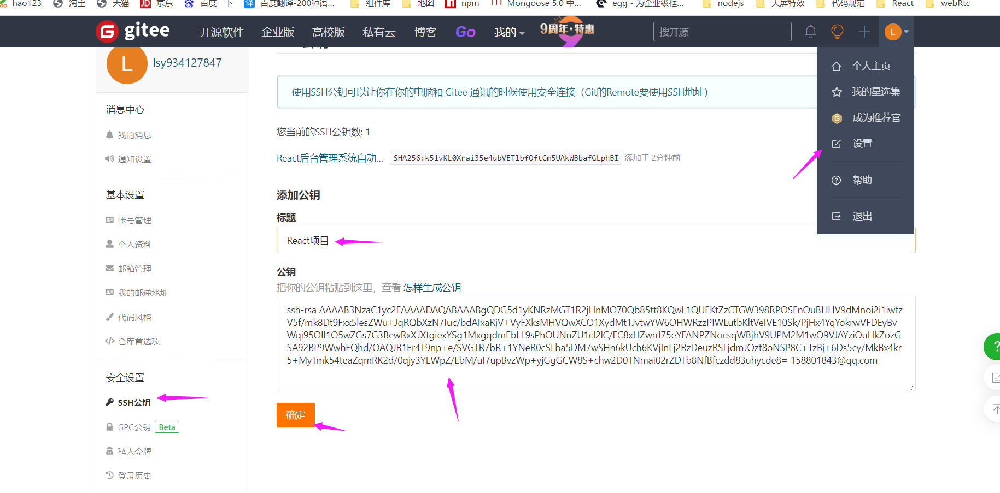

[TOC]

## 1. 安装nvm

```shell
wget -qO- https://raw.githubusercontent.com/creationix/nvm/v0.33.11/install.sh | bash
#编辑文件
vim ~/.bashrc 
#写入配置 (一般会自动写入)
export NVM_DIR="$HOME/.nvm"
[ -s "$NVM_DIR/nvm.sh" ] && . "$NVM_DIR/nvm.sh" # This loads nvm
source ~/.bashrc  # 刷新配置文件
nvm -v
```

## 2. 安装node

```shell
nvm install 16.13.1
node -v # 16.13.1
```

## 3. 安装docker

```shell

yum remove docker \
docker-ce \
docker-common \
docker-logrotate \
docker-client \
docker-client-latest \
docker-latest \
docker-latest-logrotate \
docker-engine \
docker-selinux \
docker-engine-selinux \
-y

yum install -y lvm2 yum-utils device-mapper-persistent-data

yum-config-manager --add-repo http://mirrors.aliyun.com/docker-ce/linux/centos/docker-ce.repo

yum makecache fast

yum install -y docker-ce

docker -v # Docker version 20.10.17, build 100c701
```

## 4. 安装git

```shell
yum install git -y
git --version # git version 2.27.0
```

## 5.  安装Jenkins 

### 5.1 安装 java

```shell
yum install -y java
```

### 5.2 安装jenkins

```
sudo wget -O /etc/yum.repos.d/jenkins.repo https://img.zhufengpeixun.com/jenkins.repo
sudo rpm --import https://img.zhufengpeixun.com/jenkins.io.key
yum install jenkins -y
```

### 5.3 启动 Jenkins

```shell
systemctl start jenkins.service
```

### 5.2 开放端口

```shell
# 无法访问时

firewall-cmd --zone=public --add-port=8080/tcp --permanent
firewall-cmd --zone=public --add-port=50000/tcp --permanent
systemctl reload firewalld

# 或者可以关闭防火墙
```

### 5.3 打开浏览器访问

```shell
http://106.13.9.226:8080/ # 访问
cat /var/lib/jenkins/secrets/initialAdminPassword # 复制密码 - 继续 - 选择推荐的插件
```


## 6. 集成git仓库

```shell
ssh-keygen -t rsa -C "158801843@qq.com" # 一直回车
ls /root/.ssh #authorized_keys  id_rsa私钥  id_rsa.pub 公钥 三个文件成功

```

### 6.1 设置gitee公钥

```shell
cd /root/.ssh
cat id_rsa.pub # 复制公钥 登录gitee 头像 设置 安全设置 SSH公钥 
# 如下图所示
```



