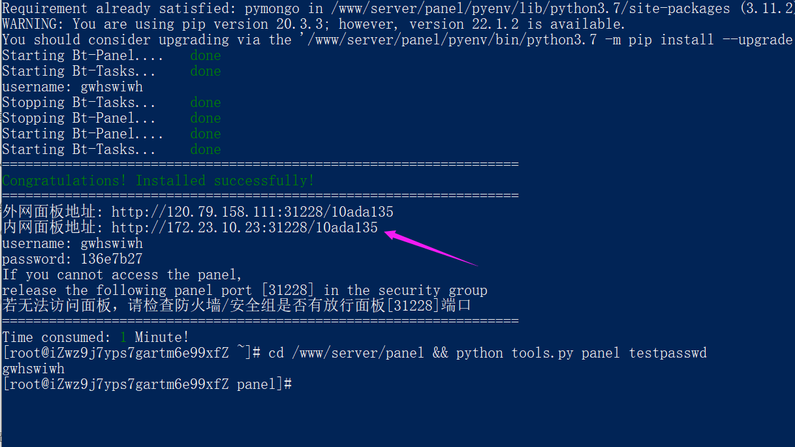
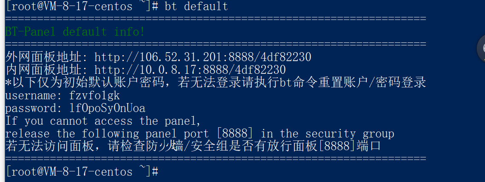
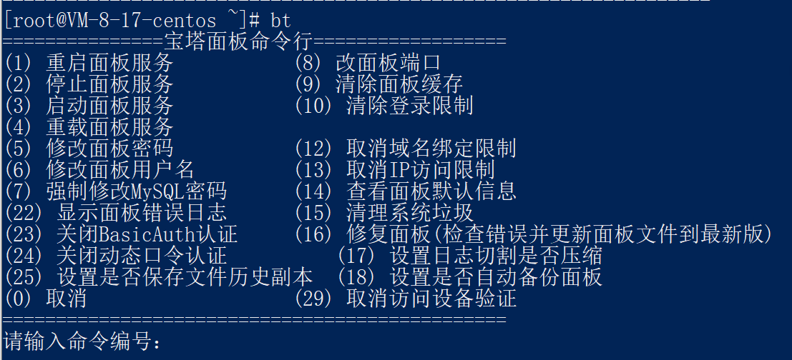

[TOC]

## 1. 安装nvm

```shell
wget -qO- https://raw.githubusercontent.com/creationix/nvm/v0.33.11/install.sh | bash
#编辑文件
vim ~/.bashrc 
#写入配置 (一般会自动写入)
export NVM_DIR="$HOME/.nvm"
[ -s "$NVM_DIR/nvm.sh" ] && . "$NVM_DIR/nvm.sh" # This loads nvm
source ~/.bashrc  # 刷新配置文件
nvm -v
```

## 2. 安装node

```shell
nvm install 16.13.1
node -v # 16.13.1
```

## 3. 安装docker

```shell

yum remove docker \
docker-ce \
docker-common \
docker-logrotate \
docker-client \
docker-client-latest \
docker-latest \
docker-latest-logrotate \
docker-engine \
docker-selinux \
docker-engine-selinux \
-y

yum install -y lvm2 yum-utils device-mapper-persistent-data

yum-config-manager --add-repo http://mirrors.aliyun.com/docker-ce/linux/centos/docker-ce.repo

yum makecache fast

yum install -y docker-ce

docker -v # Docker version 20.10.17, build 100c701
```

## 4. 安装git

```shell
yum install git -y
git --version # git version 2.27.0
```

## 5.  安装Jenkins 

### 5.1 安装 java

```shell
yum install -y java
```

### 5.2 安装jenkins

```
sudo wget -O /etc/yum.repos.d/jenkins.repo https://img.zhufengpeixun.com/jenkins.repo
sudo rpm --import https://img.zhufengpeixun.com/jenkins.io.key
yum install jenkins -y
```

### 5.3 启动 Jenkins

```shell
systemctl start jenkins.service

vim /etc/sysconfig/jenkins # 修改jenkins用户为root 防止权限问题 某些命令无法执行
# JENkINS_USER="root"
systemctl restart jenkins.service # 重启jenkins 
```

### 5.2 开放端口

```shell
# 无法访问时

firewall-cmd --zone=public --add-port=8080/tcp --permanent
firewall-cmd --zone=public --add-port=50000/tcp --permanent
systemctl reload firewalld

# 或者可以关闭防火墙
```

### 5.3 添加到docker用户组里

```shell
sudo gpasswd -a jenkins docker  #将当前用户添加至docker用户组
newgrp docker                 #更新docker用户组
systemctl restart jenkins.service  # 重启jenkins是否生效
```

### 5.3 打开浏览器访问

```shell
http://106.13.9.226:8080/ # 访问
cat /var/lib/jenkins/secrets/initialAdminPassword # 复制密码 - 继续 - 选择推荐的插件
```

### 5.4 安装相关插件

- 卸载插件后需要重启jenkins 否则会搜索不到相关插件

#### 5.4.1 NodeJS

-  系统管理 => 插件管理 => 可选插件  =>  搜索node


- 全局工具配置 => NodeJS => 新增NodeJS


- 任务的配置=>构建环境=>选中 `Provide Node & npm bin/ folder to PATH`  表示将node添加到环境变量中

  

- 第一次构建任务会拉取下载nodejs 再次构建则不需要
- 这里有个疑问 之前已经在linux服务器上下载了nodejs 和这里的有何不同

#### 5.4.1 publish Over SSH

- 同理安装publish Over SSH 插件

#### 5.4.2 gitee

- 同理安装gitee  Gitee webhook 触发构建 

## 6. 集成git仓库

```shell
ssh-keygen -t rsa -C "158801843@qq.com" # 一直回车
ls /root/.ssh #authorized_keys  id_rsa私钥  id_rsa.pub 公钥 三个文件成功

```

### 6.1 设置gitee公钥

```shell
cd /root/.ssh
cat id_rsa.pub # 复制公钥 登录gitee 头像 设置 安全设置 SSH公钥 
# 如下图所示
```


### 6.2 在Jenkins 配置私钥

任务 - 配置 - 源码管理 - Git -  **Repository URL** 


添加凭据 - 类型 ssh username with private key - 复制私钥 如下图


选择凭据


## 7 . git push 触发自动构建 

- 以 gitee为例

  项目主页 - 管理  - wehhook - 添加webhook - 填写url - 填写webhook密码


url 密码 为 jenkins 生成的地址 如下图所示


## 8 . 安装宝塔面板

1. 官网 https://www.bt.cn/new/download.html

2. Centos安装脚本 

```shell
yum install -y wget && wget -O install.sh http://download.bt.cn/install/install_6.0.sh && sh install.sh ed8484bec
```



3 常用命令

```shell
bt default # 查看登录地址 账号 密码
```

  

```shell
bt # 宝塔命令行 提供常用操作 如重启 修改密码等
```

  

## 9 . 配置ssl加密传输 https访问

https 访问 http 自动跳转到 https 配置 阿里云购买证书 下载nginx版证书 

// https://www.jianshu.com/p/e3d945fa82b4

// https://www.jianshu.com/p/5b582aad48bf